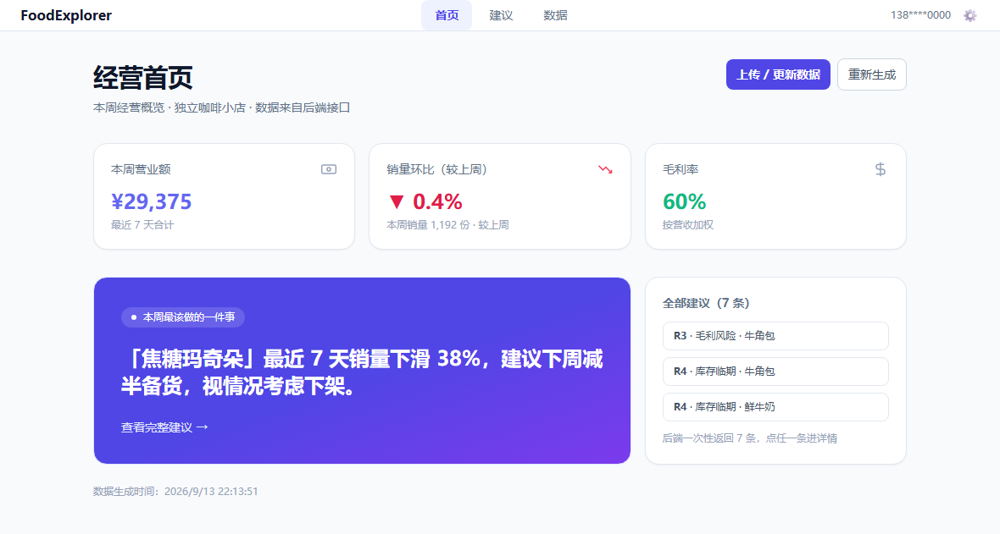
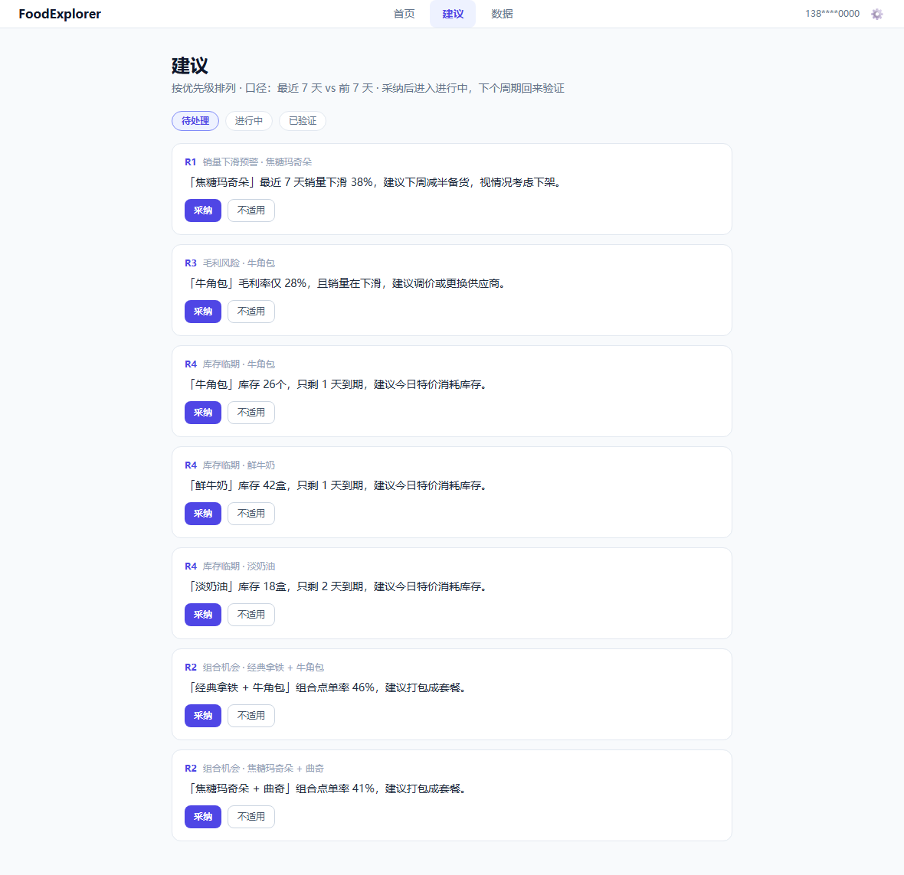
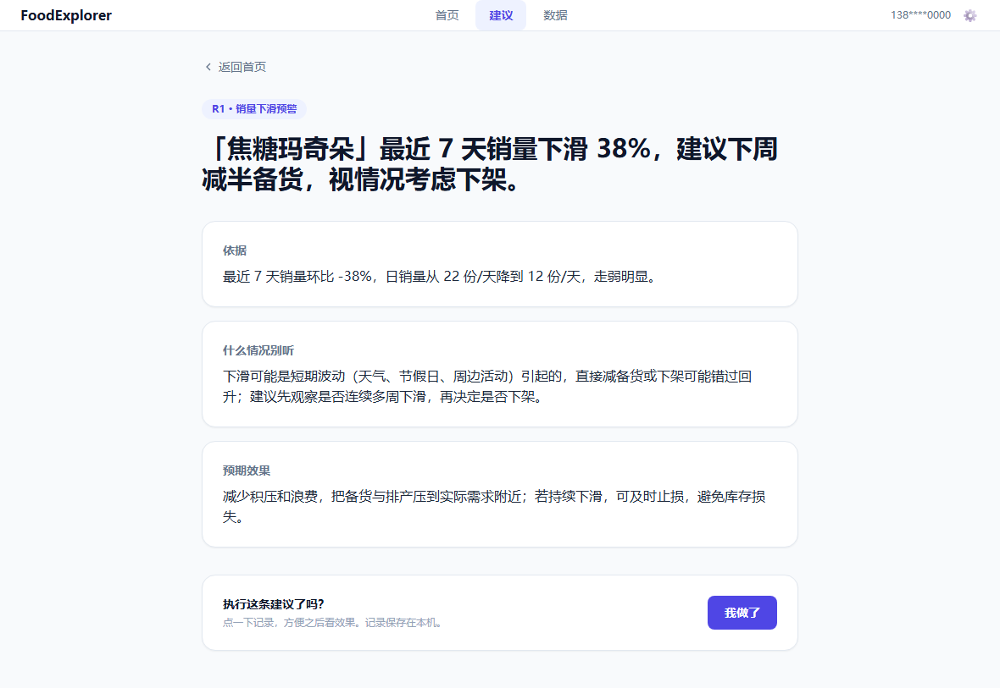
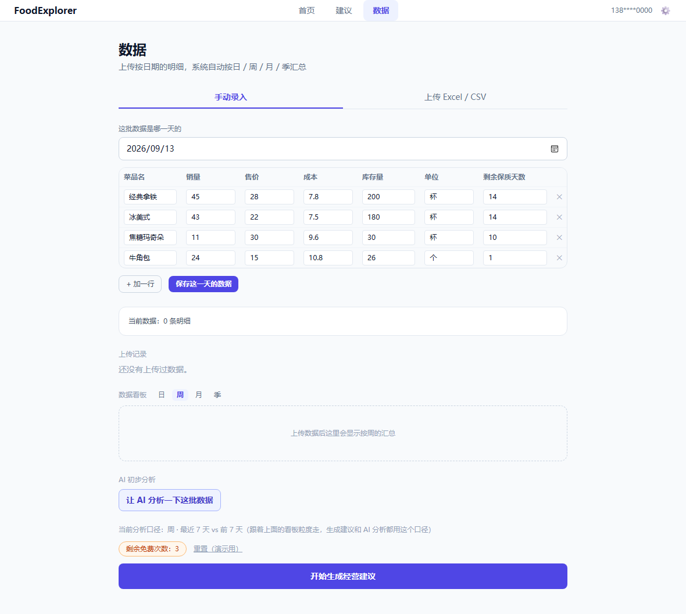

# FoodExplorer · 独立餐饮小店的经营决策助手

店主上传经营数据，系统给出「这周最该做的一件事」，并陪他验证这条建议到底有没有用。

这是一个可运行的 Web 原型，也是一份产品经理作品集：从用户研究、竞品分析、PRD、指标体系到可点击的产品，都在这个仓库里。



## 目录

- [我为什么做这个](#我为什么做这个)
- [产品定位](#产品定位)
- [功能讲解（配截图）](#功能讲解配截图)
- [一条完整的闭环](#一条完整的闭环)
- [关键产品决策与理由](#关键产品决策与理由)
- [技术实现](#技术实现)
- [本地运行](#本地运行)
- [已知限制](#已知限制)
- [路线图](#路线图)
- [相关文档](#相关文档)

## 我为什么做这个

### 小店主不缺数据，缺能读懂的结论

独立餐饮小店店主手里其实有不少数据：点单系统卖了哪些菜、进了哪些货、哪些菜常被一起点。但这些数据是散乱的。
他们看不懂 GMV、客单价、复购率，也没钱请运营或数据分析师，最后只能凭感觉做决定——要么不敢改，要么越改越亏。

我访谈过 10 位餐饮店主，听到的诉求基本一样：**我不想看懂数据，我只想知道我该怎么做。**

### 大厂没有服务这些人

现有的工具要么锁在平台自己的生态里（美团的智能掌柜、袋鼠管家），要么服务用了自家收银系统的客户（Toast IQ），
要么偏向连锁和中大型商户（Owner AI、Fourth、哗啦啦老板通+）。美国市场的集中度也很高，Toast 约占 38.6%、Square 约 18.3%。

那些还没接任何系统、靠手工记账、只用点单软件的个体小老板，现在没有人专门服务。这正好是我想验证的空档。

### 我想验证的假设

| 假设 | 怎么验证 |
| --- | --- |
| A1 店主愿意填几个数或传一张表 | 上传完成率（进入数据页 → 提交数据） |
| A2 光靠这几个数就能给出有用的建议 | 首条建议采纳率 |
| A3 极小微商户确实存在且无人服务 | 竞品分析 + 访谈 |
| A4 「免费 3 次 + 每周 1 条 + 订阅」成立 | 生成转化率 → 注册率 → 订阅率 |
| A5 店主能接受建议不一定 100% 对，但会陪着验证 | 采纳后复访率 |

## 产品定位

**门槛最低，同时直接给答案。** 先给结论，想弄明白的人再往下看依据。

| 维度 | FoodExplorer | 传统 BI 看板 / 大厂系统 |
| --- | --- | --- |
| 上手门槛 | 极低：填几个数或传一张表 | 高：要装系统、绑定平台生态 |
| 建议可执行性 | 高：直接给动作和预期 | 中：给一堆图表让你自己读 |
| 对不懂数据的人 | 友好 | 不友好 |
| 价格 | 免费 + 订阅 | 中高 |

在数据量和模型能力上我确实不如大厂——这个产品赢在便宜、好上手，服务大厂够不着的那批人。

## 功能讲解（配截图）

### 1. 经营首页：三个数字 + 本周最该做的一件事


首页只做两件事：用三个数字（营业额、销量环比、毛利率）告诉他生意怎么样，然后把「本周最该做的一件事」放大到整屏。
它对应 R1 规则：焦糖玛奇朵的销量在下滑，那就别再按原量备货。点进去就是完整建议。

### 2. 建议列表：待处理 → 进行中 → 已验证



建议按优先级排（先处理下滑和亏钱，再看机会）。每条可以「采纳」或标「不适用」；采纳后会记下当时的销量和毛利率基线，
下个周期回来核对，选「确认有效」或「没效果」。这一步是整个产品的闭环——建议必须能被验证，而不只是被读。

### 3. 建议详情：结论 / 依据 / 什么情况别听 / 预期效果



详情页刻意把「结论」放在最大的字上，下面是查得到的依据（环比、库存、毛利）。
中间那栏「什么情况别听」是我特意加的：下滑可能只是天气或节假日导致的短期波动，直接下架会错杀。
让店主知道建议的边界，比让他盲信更有用。最后是「我做了」按钮，点了就进「进行中」，同时打上埋点。

### 4. 数据页：上传 / 手动录入 / 看板 / AI 分析



- **真的能解析文件**：.xlsx 和 .csv 都行，CSV 兼容中文 Windows 常见的 GBK 编码，表格乱码的情况我处理过。也提供数据模板下载，
  列是「日期 / 菜品名 / 销量 / 售价 / 成本 / 库存量 / 单位 / 剩余保质天数」。
- **重复上传是覆盖，不是叠加**：唯一键是「日期 + 菜品名」，上传前会提示「有 N 条重复，继续将覆盖」。
- **看板按日 / 周 / 月 / 季汇总**：全部由明细自动算，不用分别维护三套数据。
- **AI 初步分析**：调 DeepSeek 从数据里自己找发现，并指出看起来可疑的数据（比如毛利率填反、库存和销量对不上），
  而不是把规则引擎的结论复述一遍。
- **分析口径跟着粒度走**：切到「月」，建议就按最近 30 天 vs 前 30 天算，文案也会跟着变成「最近 30 天下滑 X%，建议下个月减半备货」。

## 一条完整的闭环

```
录入/上传数据  →  生成建议  →  采纳（记下基线）  →  下个周期回来核对效果
      ↑                                                      |
      └────────────  数据更新后，建议重新生成  ←──────────────┘
```

这条链路对应的北极星指标是 **每周被采纳的建议数（WAR）**：店主点一次「我做了」就算一次。
它衡量的不是我们的收入，而是店主有没有真的拿到帮助，也是他之后愿不愿意付费的前提。

## 关键产品决策与理由

**1. 先给结论，再给依据。** 小店主没有精力读图表，所以默认视图是「一句话 + 一个动作」，想深究的人再展开看数字。

**2. 建议必须能直接执行。** 不说「关注毛利结构」，而是说「下周把备货减半」或者「今天特价清库存」。

**3. 免费策略按转化路径设计。** 未登录可免费生成 3 次，登录后每周 1 条，订阅不限量——先让他体验到「这建议有用」，再谈注册和付费。

**4. 匿名端的限制我选择诚实面对。** 浏览器里存的试用次数挡不住清缓存重来，硬件指纹又有隐私风险。
所以我把它当作**促成注册的软门槛，而不是防刷的硬闸**；真正的额度和身份以登录账号为准。为防刷牺牲体验，不划算。

**5. 规则引擎和 AI 分工。** 确定性结论（下滑、亏损、临期）由规则算，保证可解释、可复现；
AI 负责规则想不到的部分——找规律、指认可疑数据。这样既不会让模型自由发挥，也不至于只会复述规则。

**6. 分析口径跟着粒度走。** 看板支持日 / 周 / 月 / 季，分析口径就必须跟着变，否则界面切到「月」而建议还在算 7 天，产品是自相矛盾的。

## 技术实现

- **栈**：Next.js 15（App Router）+ React 18 + Tailwind CSS 3；数据解析用 `xlsx`；AI 分析用 DeepSeek API。
- **数据模型**：一行 = 某道菜某一天的经营数据，唯一键「日期 + 菜品名」，重复上传覆盖；看板和口径都由明细即时汇总。
- **规则引擎**：R1 销量下滑、R2 组合机会、R3 毛利风险、R4 库存临期，输出「结论 / 依据 / 风险 / 预期效果」四段结构。
- **分析口径**：以数据里最新的一天为终点，取两段等长窗口对比（日 1 vs 1、周 7 vs 7、月 30 vs 30、季 90 vs 90）。
- **埋点**：`home_view`、`advice_card_click`、`advice_mark_done` 已落地，完整事件字典见 METRICS 文档。

## 本地运行

```bash
pnpm install
pnpm dev
```

打开 http://localhost:3000 。AI 分析功能需要在项目根目录建一个 `.env.local`，写一行 `DEEPSEEK_API_KEY=你的key`；
不配也能正常使用，只是那个按钮会提示缺 key。

## 已知限制

这份清单是我主动写下来的，不是等别人发现：

1. **数据存在浏览器本地**（localStorage），换个浏览器或清缓存就没了——这是原型阶段的取舍，生产环境要换成真正的数据库。
2. **建议详情页目前只会渲染示例数据里的建议**。如果你上传自己的数据并生成建议，点进详情会提示「没有找到」——
   因为详情页是服务端渲染的，读不到你浏览器里的数据。这是下一步要修的（把详情页改成读取本机数据）。
3. 上传日志只是日志，不能按单个文件精确删除（数据已按「日期 + 菜品」合并）。
4. 组合套餐建议（R2）需要订单级数据，一张销量表给不出来——现在这条规则只对示例数据生效。
5. AI 分析的措辞每次不同，偶尔可能不准，所以我在界面上把它定位成「初步分析」。
6. 口径是两段等长窗口，不是自然周 / 自然月；数据不够长时窗口取不满，环比可能算不出来。

## 路线图

- [x] 上传解析、手动录入、冲突预检、看板汇总
- [x] 规则引擎 + AI 初步分析 + 建议状态机
- [x] 分析口径跟随粒度（日 / 周 / 月 / 季）
- [ ] 建议详情页接上本机真实数据（修掉上面第 2 条限制）
- [ ] 按日期区间删除数据
- [ ] 接真正的数据库（Supabase / Postgres）
- [ ] 补图表（销售额占比、销量趋势）
- [ ] 部署上线，拿到可访问的 demo 链接

## 相关文档

| 文档 | 内容 |
| --- | --- |
| [PRD-FoodExplorer.md](PRD-FoodExplorer.md) | 需求文档 v0.2：背景、目标用户、价值主张、功能范围、风险 |
| [COMPETITORS-FoodExplorer.md](COMPETITORS-FoodExplorer.md) | 竞品分析：定位地图、5 个直接竞品、差异化结论 |
| [METRICS-FoodExplorer.md](METRICS-FoodExplorer.md) | 北极星指标、5 个输入指标、转化漏斗、18 个埋点事件 |
| [OKRs-FoodExplorer-2026Q4.md](OKRs-FoodExplorer-2026Q4.md) | 三套季度目标 |
| [prototype.html](prototype.html) | 可点击的低保真原型（浏览器直接打开） |
| [PROJECT-STATUS.md](PROJECT-STATUS.md) | 项目进度与交接说明 |
